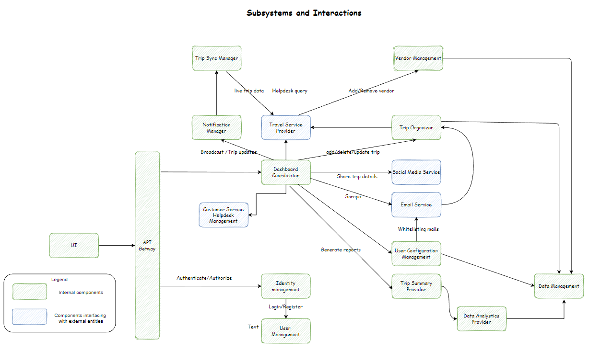
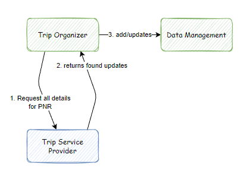
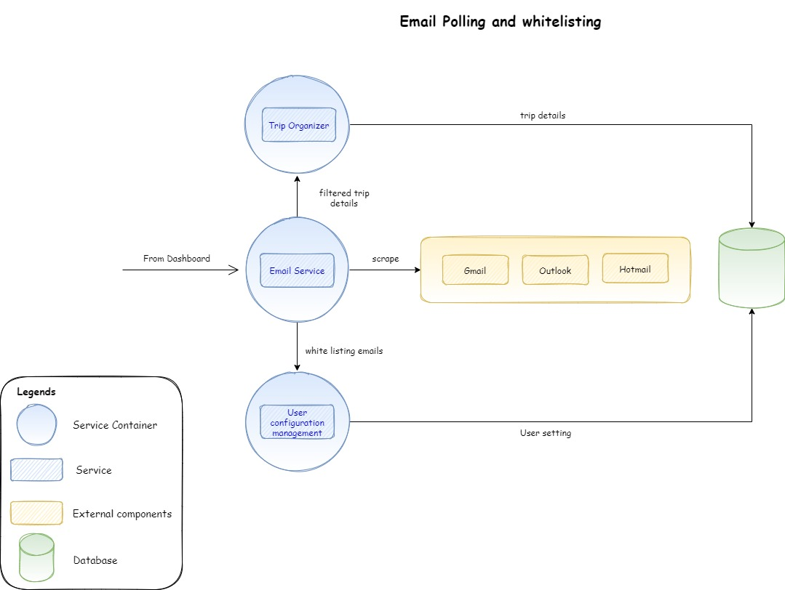
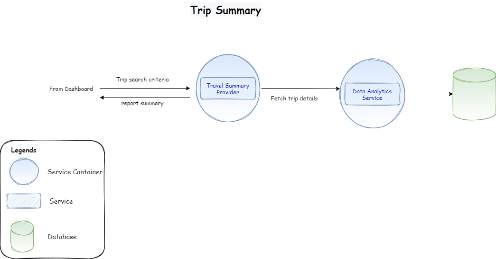
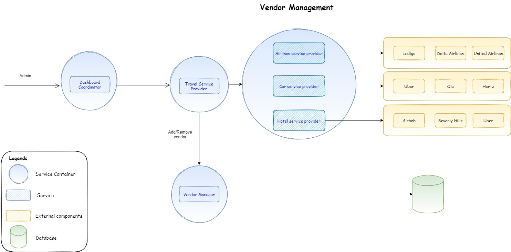
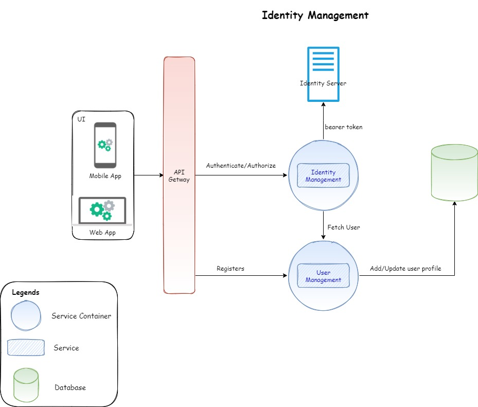
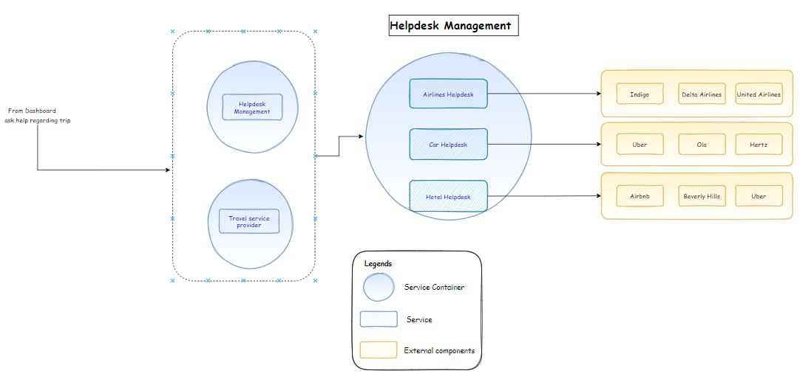

# System Scope and Context {#section-system-scope-and-context}

## Domain Model

## High level User Interaction and Use Cases

## Sub-system interaction

## Use case illustrations

The interactions between these subsystems are detailed by the major use cases below

### Register new user

### Login

* On the Login/Authenticate call Identity Management checks User credentials with User Management
* Inform Dashboard Manager of active user [will be useful for further use cases...]
* Return valid bearer token
* Valid bearer token is must for all further use case calls

**NOTE**: API Gateway will reject all subsequent calls with invalid bearer tokens
Also for simplicity sake in below diagrams The API Gateway is not explicitly shown

### Add Email Whitelist/filters

1. User config management has the responsibility to add/update/get email and filter information

**NOTE**: Use of User Config Management Service is illustrated in next interaction

### Auto update via E-mail polling

1. Dashboard Manager activates Email Service for polling and scraping emails
2. Email Service get users whitelist/filters through User Config Management
3. Informs Trip Organizer of trip/booking data from E-mail. E.g. data extracted from PNR
4. Trip Organizer will check if data is newer and commit

**NOTE**: Trip Organizer also works with Trip Service Provider to get more details on the Trip/Booking

### User manually adds/updates Trips

In this interaction Dashboard Manager directly interacts with Trip Organizer

## Subsystem Details

### Email Service

* Interfaces with different mailing services to get and scrape the user mails. Works as an aggregator for all the mail service provider.

### Trip organizer & Travel Service provider

* Travel Service provider Interfaces with 3rd party travel providers{eg. make my trip} and air,hotel, car rental service provider. To get
  * more details on PNR.
  * updates etc.

* TripOrganizer is a Key component on the dashboard using which trip details are managed (Add/Modify/delete)
  * PNR Handling

### Road Warrior DashboardManager

* Overarching component which encapsulates different service on the UI

### Data Analytics Management

* Used for user behavior tracking

### Trip Summary Provider

 

* Provides analytical options (What are the different data mining options available for traveler) to UI
* Generates reports

### Vendor Management

 

* Onboard/Adds/Removes third part vendors which provide booking services such as Airlines, Cars and Hotels

### Identity Management (Authentication & Authorization)

 

* OAuth2 integration
* User Management

### Social Media Service

 

* Interface with various social media providers
* Enables user of the RW Dashboard to share the trip info

### UserConfigurationManagement

* User related settings like whitelisting emails

### Data Management

Encapsulates storage and retrieval of Trip/Booking/User information.

* Handles quick reads
* Caching of recent user data
* Secure write/updates
* Will be used by other services in RW backend

### Trip Sync Manager

* Get the live data (real world updates) from the travel service provider.

### Notification Manager

 

* Handles the notification to the user for changes and updates in itinerary
* Broadcast messaging to all users (e.g. ads [ads may need to be as per user profiles], emergency updates)

### EventHub/Communication Manager

* Handles communications across services and components

### UserManagement

* Used for new user registration

### API Gateway

* Manages routing, load balancing etc. and will be the entry point for the UI layer for Web and Mobile app

### Customer Service And Helpdesk Management

 

* Integrates to various travel aggregators helpdesk
