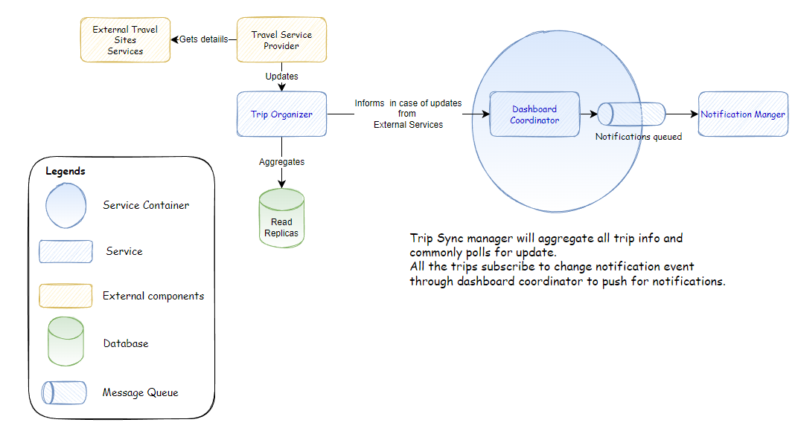

# Concepts

## Performance Optimization Strategies

### Event queueing

In case the active user load is substantial, and trip notifications become a bottle neck for Dashboard Coordinator to handle.
A message queuing mechanism is introduced. Standard message queuing solutions like RabbitMQ or Kafka would be used within the Service boundaries.

The same solution could be applied to other containers as well.

### Read replicas

On receiving trip details; services like Trip Organizer shall also cache the updates to a in-memory read replica.
This read replica will be used to improve the user experience, for e.g. during the use cases when trip details need to be updated.

--------------

### Test Strategy

[TestStrategy](TestStrategy.md)

### Test Pyramid

[TestPyramid](TestPyramid.md)

--------------

## Build and security by design

### CI-CD pipeline design for automated tests and deployment

### Security as a defacto standard

