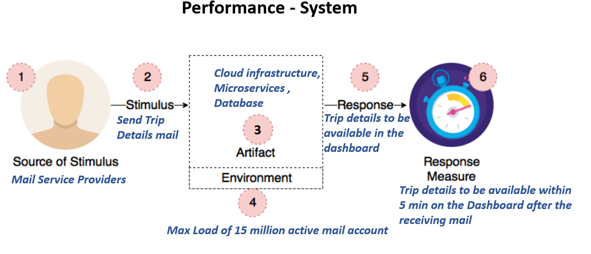

# Quality requirements

## NFR

| S. No  | Characteristics | Status | Rationale |
| ----------- | -----------| ----------- | ----------- |
| 1) | Scalability |  [x] | The system needs to support multiple users from across the globe. In order to achieve this we should be able to scale our systems (components) horizontally. |
| 2) | Performance |  [x] | The system needs to support multiple users which means there will be high traffic and some of the scenarios (like gate change, cancellation) are time critical. In order to achieve this we should enforce/ define some architecture functions. |
| 3) | Availability |  [x] | The system needs to be available at all times (as the max downtime for the system is just 5 mins). |
| 4) | Usability |  [x] | As the system should have rich UI for the dashboard/summary report we should make sure that we have arch functions defined for usability. |
| 5) | Upgradeability |  [x] | We should be able to update and upgrade the system with additional feature. |
| 6) | Extensibility |  [x] | As the system might have multi vendor, multi service support, we need to make sure that there is no vendor lock-in and the system is easily extensible. |
| 7) | Security |  [x] | As this system stores user information we need to define architecture functions to handle security. |

Other topics to consider

- Cost:
Since we are talking about having multiple services and these services will be deployed across the continents. The cost is something we need to keep in mind.  
- Configurable:
- Confidentiality:
- Integrity:
- Authentication

## Quality attribute scenarios

-----------------

-----------------

-----------------

-----------------
