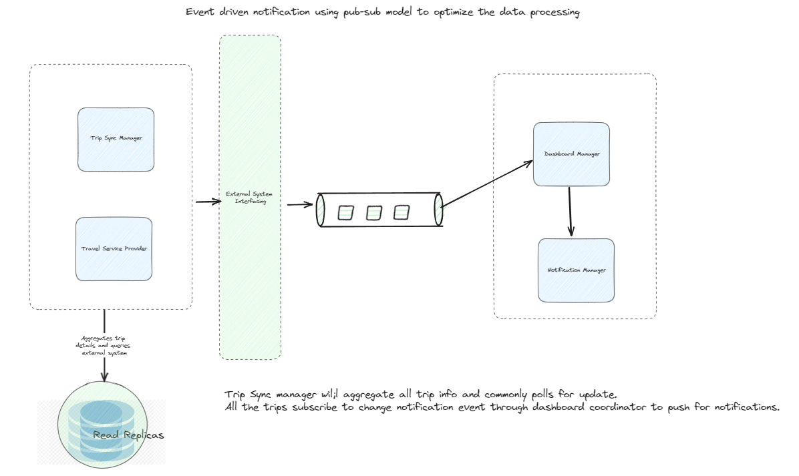

# Title: ADR-003: Event Driven Architecture

## Date: 2023-09-15

## Status: Accepted

## Context

The purpose of this ADR is to document the decision to use an event driven architecture for the new The Road Warrior Application.

## Decision

The decision to use an event driven architecture was made after careful consideration of the following factors:

* The Road Warrior Application is expected to be event-driven, and an event driven architecture will make it easier to implement this requirement.
* The Road Warrior Application is expected to be loosely coupled, and an event driven architecture will make it easier to achieve this.
* The Road Warrior Application is expected to be scalable, and an event driven architecture will make it easier to scale the system.

## Consequences

The consequences of using an event driven architecture include:

* The system will be more complex to design and implement.
* The system will require more monitoring and management.
* The system will be more difficult to test and debug.

## Mitigation Strategies

The following mitigation strategies will be used to address the challenges of using an event driven architecture:

* We will use a well-defined event driven architecture framework (like RabbitMQ) to guide the design and implementation of The Road Warrior Application..
* We will use a message broker to manage communication between components of The Road Warrior Application..
* We will use a continuous integration and continuous delivery (CI/CD) pipeline to automate the deployment and testing of The Road Warrior Application.

## Next Steps

The next steps are to:

* Complete the design of the event driven architecture.
* Implement the event driven architecture.
* Deploy the event driven architecture to production.